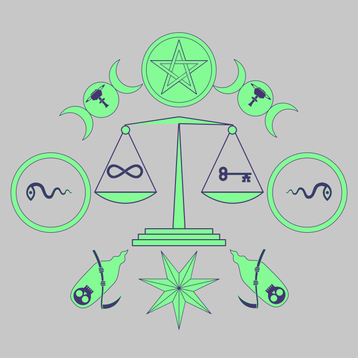
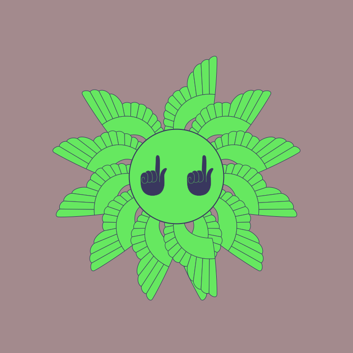
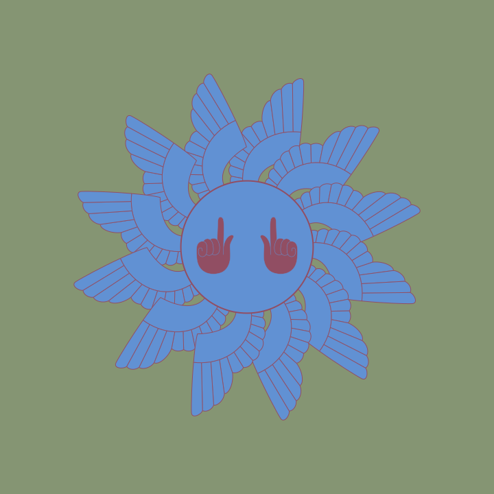
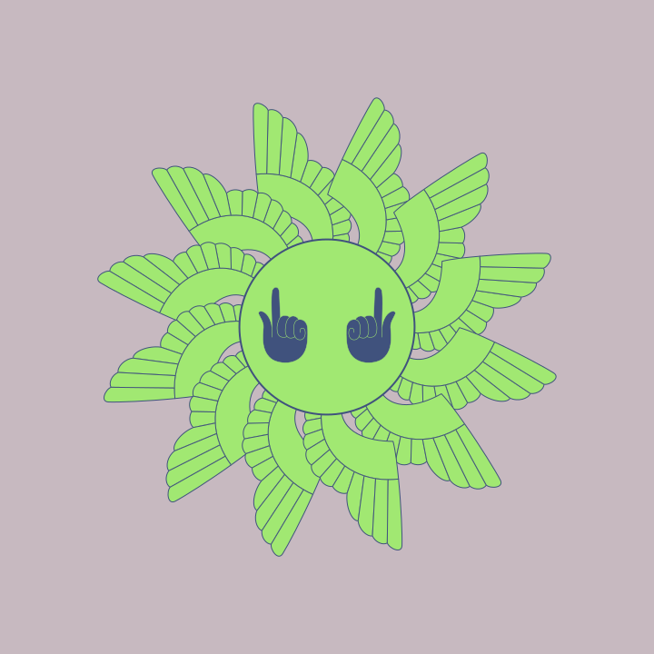
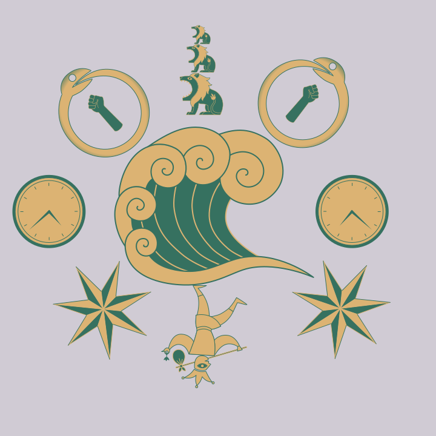

`sibyl.js`
---

```
$ node sibyl.js -h
version: 0.1.0

usage:

    sibyl [-h] [-v] <svgjson> <command>

  <svgjson>                   svgjson file
  <command>                   random|<dsl>
  [-h]                        show help (this screen)
  [-v]                        show version

```

#### Random Creature

```
node sibyl.js ./_svg-vocabulary-pretty-printed.json random > out.svg
```

#### Creature With DSL


```
node sibyl.js ./_svg-vocabulary-pretty-printed.json 'scales @ [infinity,key] ^ pentacle ! (moons_triple@mushroom_cloud) ~ (ring@ snake_eye) | death . star_7pt ' > out.svg
```


Description Language
---

Here is a simple character to highlight the syntax:

```
    !^!
[] ~(@)~ {}
     .
    | |
```

| Symbol | Meaning | Description |
|---|---|---|
| `^` | crown | |
| `!` | horn | |
| `~` | arm | |
| `@` | nesting | |
| `\|` | leg | |
| `.` | tail | |
| `()` | sub-expression | |
| `[]` | ring | |
| `{}` | random | |

For example, Here is a simple creature with most the features listed above:

```
scales @ [infinity,key] ^ pentacle ! (moons_triple@mushroom_cloud) ~ (ring@ snake_eye) | death . star_7pt
```

That produces

| |
|---|
|  |


The `ring` (`[]`) (not to be confused with the symbol `ring`) iterates through the list, modulo
the attach point index.

By default, the symbols are inverted every other index but an optional negation (`-`) can be
used in front of the symbol to reverse the direction.
This negation can be done for both nesting and other attach points.

Here are some examples to illustrate the idea:

| | |
|---|---|
| `face_nest @ hand_point ~ wing_angel2 ` |  |
| `face_nest @ [hand_point,-hand_point] ~ [wing_angel2,-wing_angel2]` |  |
| `face_nest @ [-hand_point,hand_point] ~ [-wing_angel2,wing_angel2]` |  |

The `{}` produces a random drawing from the list, with `*` being the 'universe' and a negation being a
removal of that item, with order mattering.
The `{}` can be thought of as a 'macro' with it expanding at "compile time".


For example, here is a creature, without Bob or his pipe:

| | |
|---|---|
| ` {*,-bob,-pipe} @ {*,-bob,-pipe} ^ ({*,-bob,-pipe} @ {*,-bob,-pipe}) ! ({*,-bob,-pipe}@{*,-bob,-pipe}) ~ {*,-bob,-pipe} \| {*,-bob,-pipe} . {*,-bob,-pipe} ` |  |

If a symbol doesn't have the attach points, the specified symbol will be ignored.


Notes on Tarot
---

* The minor arcana tend to have the items suite be the same size
* The default minor arcana are wands, pentacles, cups, swords (wands are missing currently)
  - alternatives for wands: `antler,bone_vertical,branch,feather,key,unihorn,infinity,book_open,cube_die,cube_paradox`
  - alternatives for pentacles: `pentacle,scales,thistle,triskele,atom,bicycle,clock,egg`
  - alternatives for cups: `beaker,bottle,cup,heart,flower,lotus,pomegranite,pear,teacup,teardrop,urn`
  - alternatives for swords: `sword,knife,dagger,coffin,eagle_head,flame,lightning,lion_tail,mushroom_cloud,oroboros,pitchfork,saturn,trumpet`
* One idea is to have a few different arrangements for the cards (with crown or nestings, say) and then have a creature in the background
* Each suite and major arcana cold have have a 'theme' of a background
  - For complex backgrounds: sun rays, water, water with hills and trees, clouds
  - For simple backgrounds, could have a single symbol or repeating symbols (taken from `background=true` from the `.toml` files)

Major Arcana:

| | | | | |
|---|---|---|---|---|
| 0 fool       | 1 magician | 2 priestess | 3 empress  | 4 emperor     |
| 5 hierophant | 6 lovers (`[woman_stand,man_stand]`)  | 7 chariot   | 8 strength | 9 hermit      |
| 10 wheel     | 11 justice (`scales`) | 12 hanged  (`coffin`?)  | 13 death (`skull`,`skeleton`?)  | 14 temperance  (`waterworks`) |
| 15 devil     | 16 `castle_tower`   | 17 starburst     | 18 moon    | 19 sun        |
| 20 judgement (`angel`) | 21 globe |             |            |               |


The minor arcana have the page, knight, queen and king.
There's a knight, but maybe the horse is more appropriate.
For the king and queen, it might be good enough to have a man and woman with a crown.
Maybe the baby for the page?

For the king/queen, it could be just picking two animals arbitrarily, like the rabbit, lamb, lion, bird,
with a crown and the suite symbol.
For the page, it could also be a random animal, same with the knight.
Here are some potential options:

* `bicycle`
* `bird`
* `bitey_half`
* `capricorn_tail`
* `cow_head`
* `dog`
* `eagle_head`
* `eagle_shield`
* `fish`
* `goat`
* `horse`
* `lamb_head`
* `lion`
* `rabbit`
* `tail_eagle`
* `tree_rooted`

Maybe also the wings?

So, here's a first stab:

| | |
|---|---|
| page | `bird,bird,dog,baby,rabbit` |
| knight | `bicycle,capricorn_tail,fish,goat,horse,tail_eagle` |
| queen | `bitey_half,cow_head,eagle_head,eagle_shield,lamb_head,lion,tree_rooted` |
| king | `bitey_half,cow_head,eagle_head,eagle_shield,lamb_head,lion,tree_rooted` |

Where the king and queen are drawn from the same list but chosen to be different symbols.
Maybe the king/queen also make sure to have a crown either for it's nesting or crown placement
and the suite for it's crown placement/nesting.


Notes on SVG
---

```
       crown
 horn          horn
    arm     arm
      nesting 
    leg     leg
        tail

       anchor
```


