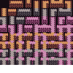
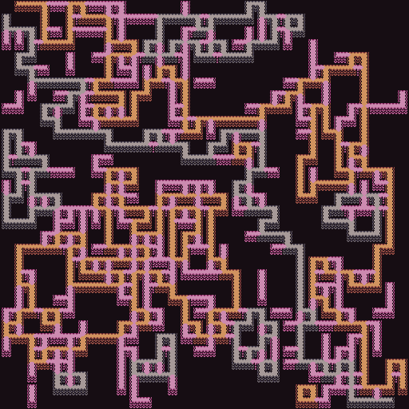

Tileset Experiments
===

I believe I can create "two loop" and "acyclic path" from just
local tileset rules but I would like to validate the idea
before proceeding further with other more general tilesets.

Two Loops
---

A bit of a misnomer.
It's really two paths, non intersecting, that start and end
at a common point, creating a non intersecting loop.

The idea is to create a tileset that has
three sets of tiles, one with only two connectors for
one side of the loop, another with only two connectors for
the other side and another set that connects between the two
and is more freeform.

This can be thought of in terms of "colors".
One tileset is colored grey and only has bends and straights,
save for the start and end portion of the path
The other is orange and again has only bends and straights with
the exception of the start and end of the path.

The third is pink and has ends, bends, straights, tees and crosses
but also bridging tiles to the grey and orange tiles.
The bridging tiles only allow two connectors for the grey and orange
to keep the forced path for the other two tilesets.

---

Well, looks like it works.

Here is the modified tileset:

To replicate the path functionality as described in DeBroglie, one would need to color all paths the same.
They've been colored here for clarity.

The idea is that there are three different colors (plus 'empty').
The grey and orange paths represent the two sides of the loop that you want matched up.
The pink path is the extra path information that can be used to fill in other paths.

During setup, an end tile of each of the grey and orange paths is placed at either corner and
then removed from the rest of the grid, so that only grey and orange walls that have connect
count of 2, for their respective colors, remain.
Other tiles are added to the tileset for grey and orange that connect up with the pink tiles,
but only so that the connect count of 2 is maintained.

Anyway, pretty straightfoward. I don't know how well the solver will do if depending on which type
of constraints get added.

Here's a result:

Acyclic Path
---

The idea here is to create a main `a` path but then add `c` "levels",
so in addition `a` path, there are `c0` docks, which then are themselves
two path docks but with a `c1` tee and cross extra dock.

The tileset doesn't blow up because only the level below it needs to dock
to the one above it but it does need to be cut off, limiting the branching
factor of the acyclic path.

---

This doesn't quite work.

Instead, this is a possibility:

* create some number of tileset "colors", say 4
* for each color, have a color gredation so that every time a path is
  extended, it needs to connect to the same color but faded
  (tile $n$ has to connect to tile $n-1$ in front and $n+1$ from behind)
* a color can branch into a new color

The maximum branching factor is limited by the colors, and the length of each
branch is limited by the gredation count.
Branching need not completely alter the spine, so a color can branch to another
color but still keep its countdown.

This inflates the tile count significantly as you need a set of tiles
(bends, straights, etc.) for each tile color gredation, but I think this at
least avoids the exponential explosion.

---

This still doesn't work.
The tileset scales as grid size, as you need a different tile for each length of path
that you want

Why doesn't the initial idea work?
Right, doesn't work for 3d or for arbitrary 2d.
The branches can loop back and connect in on themselves.
If the path partitions the space, this is not an issue, but so long
as there's an opening, the sub branches could wind around and connect up.

The decrementing path specifically forbids that because it must connect
to a strict subchild, with the appropriate dock...but now thinking about
it, this still might not work.

ok, how about this:

* create a 2 dock tile with a parity dock, so a tile consists of
  two docks, one with color red, the other with black
  - black can connect to red and vice versa but black-black and red-red
    disallowed
  - branching creates red-black tiles that can only ever match up
    with a begin red and end black
  - end caps have black connector

---

???

ok, nope, above still has issues.

An illustrative example:

* orange tile path branches to a grey tile path.
  - grey tile has p joining to orange and q acceptor outward
* further on down the way, orange path branches again which

Cyclic Path
---

I think there's a way to embed a cyclic path generator with local rules.

The idea is like the "two loop" but instead there's the possibility of
branching new loop spawn points.

So, each side of the loop are their own colors.
Each color can be replaced by a branch with two sub-colors.

The two sub colors can recombine into the parent color.
Maybe we want to give a countdown to ensure the paths have a chance
to get fare enough apart from each other.

References
---

* [path constraints in debroglie](https://github.com/BorisTheBrave/DeBroglie/blob/master/docs/articles/path_constraints.md)
* [constraints in debroglie](https://github.com/BorisTheBrave/DeBroglie/blob/master/docs/articles/constraints.md)
