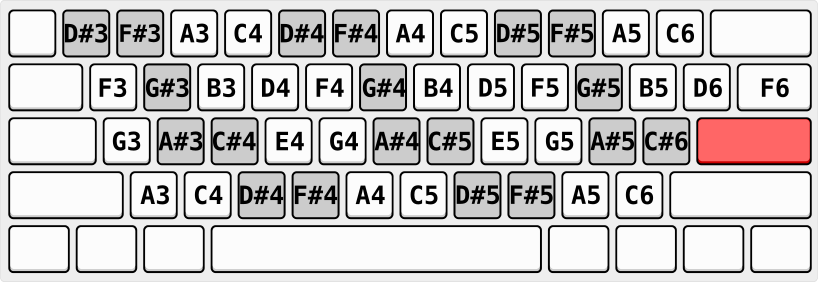

Turning Tape
===

Have a 'turning' box that takes in a tape that plays tunes.

---

In order to progress, you meet various denizens that you need
to overcome with music to proceed.

The denizens block access, give keys, gifts or currency for
every successful challenge/response.

---

| Type | Challenge |
|---|---|---|
| Parrot | Play back tune |
| Beat | Play drum beat |
| Copycat | Will copy the tune you play |
| Chord | Will play a chord from the note you play |


---

There are different instruments with music sheets that can be fed
as input.

The sheets can be linear, looped, maybe looped with a certain length, etc.

Each song pumped through the instrument can produce different effects.
Some might be environmental, some might influence the creatures on the island,
some might open doors, some might be one time use, etc.

The island is basically a lock and key portion, with different creates that you
can interact with that will give you scrolls or songs that you can then input
into your instrument.

Here are some ideas:

* Birds in different corners of the island play pieces to a song that you can put together
  to unlock something. Each birdsong can be relatively simple but layering them on top of
  each other can produce an interesting tune
* Finding a shopkeeper tune that amuses a shopkeeper will give you a 'one time use' tune
  that awards an ability, faster movement, jumping, flying, swimming, etc.
* Two monsters at separate locations each play part of a tune. By playing one monsters tune
  to the other, they get closer to the other monster and give another tune, which you can then
  give to the other monster. Eventually they meet and play the tune with each other in its
  entirety, giving you the reward
* This can be generalized to N monsters
* A creature plays a small tune from a synth, where you need to not only recreate the (maybe
  simple) tune but also the subtractive synthesis patch that makes it sound like the creature
  (mimic the creature to fool some other creature somewhere else on the island)
* A scroll is given but with notes missing. Fill in the missing notes and play to unlock the secret,
  maybe with some other creature giving a clue as to how to complete the tune
* Play a permuted tune (inverted, reversed, octave shifted, sped up, slowed down, etc.) to unlock mystery
* Use note patterns in a particular key with rules (start on tonic, end on tonic, etc.) to
  progressively unlock maze
* Playing same tune in different key to change it's character (sad to happy, happy to sad, mysterious to
  tense) which can change a monsters state from sad to happy, happy to sad, etc, opening the way or
  giving rewards

So the idea is that understanding the shopkeeper tune will give you a type of currency for that island, which
you can then turn into one time use scrolls that award effects.
The currency might even be a base tune which has transformations that the shopkeeper accepts, allowing for
only a finite amount of currency on that level.

Some music spells always work (say, summoning a boat to hop islands, or teleporting to other locations),
other spells only work once (scrolls), some spells only work in a particular island or in a particular location 
on the island.

---

update: consider it a roguelike except with no combat, music as the main challenge and your synthesizer as your 'weapon'

Call it a bard-like.

---

continuing on with the bard-like theme:

* dungeon with lock/key puzzles musical challenges ala Russo
* chests knock to open
  - can use to establish base line tempo sequence
  - gives instruments (flute, guitar)
  - gives parchement
* guard statues need to hear tune to unlock door
* other effects after successfully producing tune:
  - water/lava raises/lowers
  - drawbridge/bridge/pathway appears
* HUD to play music
  - can have continuous sequencer so that bard can unlock places
    while walking around
* NPCs and others can give cryptic messages but help screen provides
  detailed plain english description of tasks

Let's try make a simple introductory level:

```

#######   ###########
#]...]#   #]...]...]#
#.....#####.........#
#.....+.+.+.........+
#.....#####.........#
#]...]#   #]...]...]#
#######   ###########

```

The initial test has a tempo clue on it:


```

##################
#                #
#   +  +  +  *   #
#   |  |  |  |   #
#                #
##################

```

In general, tempo spacing:

```
 *  +  : :  . . . .  z
 |  |  |_|  |=|=|=|
```

experimenting with notation:

```
 *c4 +c4  :c4 :c4  .c4 .c4 .c4 .c4
  |   |    |___|    |===|===|===|
```

Another idea:

```
 c4* c4+ c4: c4.
```

The chest opens to give a single note flute.
Four chests in total and the flute can be strung together to create a flute with the
four notes we care about.

Tempo should be learned at this point (re-enforced 4 times).

Arming the flute, it only allows for `*e4,*g4,*a4,*b4`.

Flute notes must be played in order for door to open to next area.
Door has clue along with verbose help.

Again for middle door (notes played in order/ascending).

Last door down corridor leads down where flute notes must be played in reverse order
to open door (again, clue with verbose notes).

(re-encorced thrice).

So far, flute can only be played in 'real time' (or some equivalent for
turn based systems?).

Second room has multiple chests, each with a parchiment piece.

To open:

* one must start on tonic
* one must end on tonic
* one must have all notes (in any order)
* one must not have all notes (in any order)
* one is free form
* one must repeat

total of six measures, re-enforced six times.

Parchement put together to create song (ask for name?).

Parchment then played on guard in door writes tune into
world lexicon, opens gateway and opens next section.

### Second Floor

Note restriction: `f4,a4,b4,c4 | f5,a5,b5,c5`

Tempo restrictions: `. . . . : :` `: : . . :`

Two chests, each with a tempo clue, that gives, `c4` and `f4`.

Pick up item that gives pitch shift ability to flute.

Figure out a way to 

* one must start on tonic (2.a.0)
* one must end on tonic   (2.a.1) 
* one must repeat         (2.a.2)
* three are free form     (2.a.[345])

Chests have different codes, depending on whether they
have to start with a tonic, what kind of scale restriction
they have, etc.
In some sense, the 'monsters' are these smaller challenges.
Larger challenges are gates but can be thought of as larger monsters.
Maybe they are monsters directly and can be swayed/banished depending
on what type of tune is played.

They all give parchement piece, six measures long.

Use `2.a.0` to start, `2.a.1` to end, rest anywhere in the middle.

---

After first monster defeated (2.a), reveals room with final flute reed, `d4`, as treasure/prize.

Three doors that have note order restriction:

```
d4 a4 f4 e4 c4
```

Notes can be repeated and other octaves can be used.
So it's a Markov chain with self loops on each node and
`d4 -> a4 -> f4 -> e4 -> c4`.

Rhythm restriction: `: . . +` `z . . .`

six to ten measures long.

So, how about this, something like, monsters
that have sub restrictions (starting/ending on a tonic,
some number of measures long).
When each is defated, they coallesce into a larger
monster that needs all elements to be put together (in order).

So, for example, three monsters, the first needs to start on
the tonic, two measures long, second, two measures long, free
form, third, two measures long, and on a tonic.
Once defeated, merge into larger monster that needs to be
defeated with concatenation of three sub tunes.

This particular challenge doesn't need this detail but could
be used for future challenges.

---

next room has:

note restriction: c-major (`c4,d4,e4,f4,g4,a4,b4` with other octaves)

tempo restriction: `: . . +`

start and end on tonic

repeat at least one measure.

---


next room:

water/lake/waterfall/stream/rain

same note restriction, c-major, but starts on `d4` (d Dorian scale).

`d4 e4 f4 g4 a4 b4 c4 d5`

rhythm restriction: `: . . +`

start and end on tonic

repeat at least one measure.

---

next room:

dark/moody

e phrygian

`e4 f4 g4 a4 b4 c4 d5 e5`

6-10 measures

rhythm restriction: `: . . : :`  `: : +`


---

mistake exercise?

joker? start end on non-tonic (and not on the same note)

don't repeate

I say we nix this...


Notation
---

```
Tempo Token:

          whole
          | half
------------------
Normal|   * + : .
Sharp |   $ - ; ,
Flat  |   % _ = !
------------------
              | eighth
              quarter

' ' ' ' ' ' ' ' '
` ` ` ` ` ` ` ` `
' ' ' ' ' ' ' ' '
` ` ` ` ` ` ` ` `
' ' ' ' ' ' ' ' '
` ` ` ` ` ` ` ` `
' ' ' ' ' ' ' ' '

(working draft)

    sharp

*c4 $c4 %c4
+c4 -c4 _c4
:c4 ;c4 =c4
.c4 ,c4 !c4

        flat

zZ rest

(nixed)

*c4  *c4# *c4b
+c4  +c4# +c4b
:c4  :c4# :c4b
.c4  .c4# .c4b

```

Some things I've settled on so far:

* single character length codes with modifiers for sharp or flat
  - ` *$% +-_ :;= .,! ` *tempo token*
  - add note as suffix for note token (e.g. `*c4 $c4 .c4 :c4`) *note token*

Still not sure what view to use, but here are some possibilities:

* left to right with backticks and single tick spacers using tempo tokens
  - expand out to use note tokens (will take 2x more spaces)
* top to bottom with backticks and single tick spacers using tempo tokens
  - expand out to use note tokens (will take 2x more spaces)
  - nix this, this is way too superfluous and doesn't take up much more
    space than the left to right notation
* string of note tokens (without positioning)

tempo only notation:

```
 + + + *
```

Synth Basics
---

```
      : lfo_0  :
      : (freq) :
          |
      : osc_0 :\              
                \          : lfo_f :   : lfo_a :       : lfo_? :
: lfo_1 : -\     \             |          |               |
        osc_1 :--: gain :--: filter :--: adsr :------: effects :----: out    :
                /          :(lp, bp,:  :(gain):      : (chorus,:    : (gain) :
      : osc_2 :/           :hp, etc):                :  delay, :
          |                    |                     :   etc)  :
          |                    |
       : lfo_2  :          :  adsr  :
       : (freq) :          : filter :


```

Notes
---

```

    ' ' ' ' ' ' ' ' '
    ` ` ` ` ` ` ` ` `
    ' ' ' ' ' ' ' ' '
 &  ` ` ` ` ` ` ` ` `
    ' ' ' ' ' ' ' ' '
    ` ` ` ` ` ` ` ` `
    ' ' ' ' ' ' ' ' ' 


```

Idea - make the dungeon the step sequencer
---

Instead of having a HUD that pops up to create the notes, we
make the dungeon itself the step sequencer.

```

```

---

Chromatic Button Accordian layout:

| |
|---|
|  |

(see [a](https://okathira-dev.github.io/client-web-api-sandbox/button-accordion-with-keyboard/index.html) [b](https://www.rmwinslow.com/tones/))
