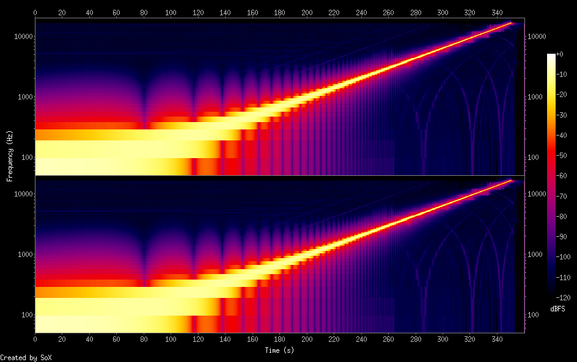
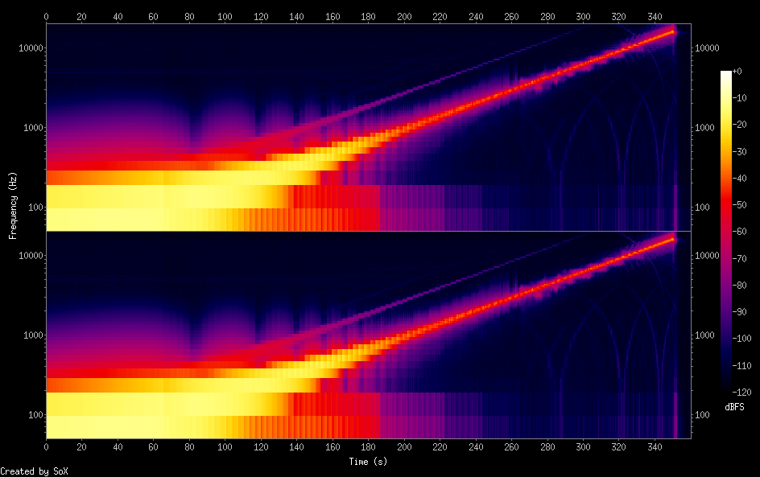

Voice Effects
---


Notes on voice effects.

---

Enable 'low-latency' recording from mic to speaker:

```
pactl load-module module-loopback latency_msec=1
pactl unload-module module-loopback
```

---

Attempts at using `arecord` to `aplay` to go from mic to speaker:

```
stdbuf -o 0 arecord --buffer-size=512 | stdbuf -o 0 -i 0 aplay -
```

---

Getting closer:

```
arecord -r 192000 -f s16_le --buffer-time=20 - | aplay --buffer-time=40 -
```

(see [so](https://askubuntu.com/questions/123798/how-to-hear-my-voice-in-speakers-with-a-mic))

---

Another [so](https://superuser.com/questions/87571/how-to-hear-mic-sound-over-speakers-ubuntu-karmic) incantation:

```
pacat -r | pacat -p --fix-rate --latency-msec=10
```

or

```
pacat -r --latency-msec=1 -d alsa_input.pci-0000_00_1b.0.analog-stereo | pacat -p --latency-msec=1 -d alsa_output.pci-0000_00_1b.0.analog-stereo
```

---

[This](https://juho.tykkala.fi/Pulseaudio-and-latency) apparently does a good job:

```
$ pactl list modules 
...
Module #6
        Name: module-alsa-card
        Argument: device_id="0" name="pci-0000_00_1b.0" card_name="alsa_card.pci-0000_00_1b.0" namereg_fail=false tsched=yes fixed_latency_range=no ignore_dB=no deferred_volume=yes use_ucm=yes card_properties="module-udev-detect.discovered=1"
        Usage counter: 3
        Properties:
                module.author = "Lennart Poettering"
                module.description = "ALSA Card"
                module.version = "8.0"
...
$ pactl unload-module 6
$ pactl load-module module-alsa-card device_id="0" name="pci-0000_00_1b.0" card_name="alsa_card.pci-0000_00_1b.0" namereg_fail=false tsched=no fixed_latency_range=yes fragments=1 fragment_size=15 ignore_dB=no deferred_volume=yes use_ucm=yes card_properties="module-udev-detect.discovered=1" 

35
```

```
pacat -r --latency-msec=1 -d alsa_input.pci-0000_00_1b.0.analog-stereo | pacat -p --latency-msec=1 -d alsa_output.pci-0000_00_1b.0.analog-stereo
```


Formating
---


```
pacat -r --latency-msec=10 -d alsa_input.pci-0000_00_1b.0.analog-stereo > t.raw
sox -t raw -b 16 -e signed -c 2 -r 44100 xxx.raw out.wav
```

---

And finally:

```
pacat -r --latency-msec=40 -d alsa_input.pci-0000_00_1b.0.analog-stereo | \
  sox -t raw -b 16 -e signed -c 2 -r 44100 -  \
      -t raw - \
      ladspa autotalent.so 440 -10.763 0 0 0 0 0 0 0 0 0 0 0 0 0 1 1 0 0 0.44 0 1 1 0 1 0 1.0 0.03 0.98 0 | \
  pacat -p --latency-msec=40 -d alsa_output.pci-0000_00_1b.0.analog-stereo
```

Verifying Autotalent
---


Use this [video](https://www.youtube.com/watch?v=aId2LNZEuKo) (CC-BY-SA from NUMO TV), available as an [mp3](assets/20hz-19931hz.mp3) in this repo.

```
$ ffmpeg -i ../assets/20hz-19931hz.mp3 out.wav
$ ./sox-test-run out.wav
$ sox+ out.wav -n spectrogram -L -R50:20000 -o ../assets/orig_spectrogram.png
$ sox+ out_auto.wav -n spectrogram -L -R50:20000 -o ../assets/auto_spectrogram.png
```

| | |
|---|---|
|  |  |

I'm not sure the picture is so enlightening.
If you squint just right, you can see in the autotuned version that there are what looks like 12 discrete steps from 190s to 232s where it goes from
880Hz to 1760Hz but they're in the higher order harmonics and it's not clear that they wouldn't be there anyway.

It's easier to hear:

```
$ mplayer out_auto.wav
```

You can clearly hear discrete steps as it jumps.

---

`sox+` is my [own custom version](https://github.com/abetusk/sox) of `sox` with the logarithmic spectrogram ([via](https://github.com/jdesbonnet/joe-desbonnet-blog/blob/master/projects/sox-log-spectrogram/spectrogram.c))
