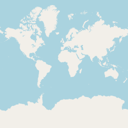

OpenStreetMap Notes
===

###### 2020-02-17

Following [src](https://www.youtube.com/watch?v=savQWL0kq_g)

---

```
https://tile.openstreetmap.org/{zoom}/{x}/{y}.png
```

Example: `https://tile.openstreetmap.org/0/0/0.png`

;

---

Common open schemas for vector tiles:

* OpenMapTiles
* Mapszen Tilezen

Closed schemas:

* Mapbox Streets
* Thunderforest

---

Formats:

* GeoJSON
* TopoJSON
* Mapbox Vector Tile
* o5m
* OpenScientMap Binary
* Arc GeoSErvices JSON

---

Creating your own tile server:

* [Mapzen Vector Tile Server](https://github.com/tilezen/tileserver) [wiki](https://github.com/tilezen/vector-datasource/wiki/Mapzen-Vector-Tile-Service)
